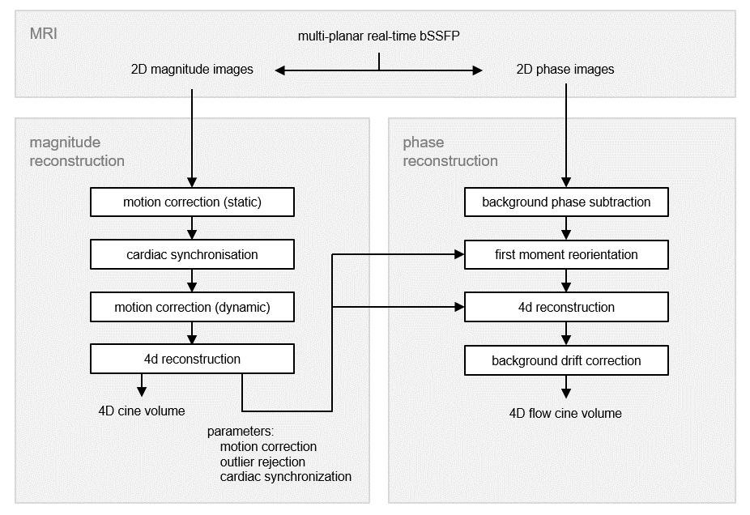

# fetal_cmr_4dflow

fetal whole heart 4D flow cine MRI using multiple non-coplanar balanced SSFP stacks

## Publications

__Fetal whole-heart 4D flow cine MRI using multiple non-coplanar balanced SSFP stacks__  
Thomas A. Roberts, Joshua FP van Amerom, Alena Uus, David FA Lloyd, Anthony N. Price, Jacques-Donald Tournier, Laurence H. Jackson, Shaihan J Malik, Milou PM van Poppel, Kuberan Pushparajah, Mary A Rutherford, Reza Rezavi, Maria Deprez, Joseph V. Hajnal. 

__bioRxiv__. 2019. doi: [https://doi.org/10.1101/635797](https://doi.org/10.1101/635797) (_pre-print_)  

## Directories

__4dflow_recon__ - pre- and post-processing scripts for 4D cine flow reconstruction

__lib__ - sub-functions and scripts

__paraview__ - visualisation of 4D cine flow volumes in Paraview: [https://www.paraview.org/]

__matlab-common__ - submodule containing useful MATLAB scripts (nb: when cloning this repo, use command line option `--recurse-submodules` )

## Dependencies

__SVRTK__ - slice-to-volume registration reconstruction software. Similar to IRTK, but now compatible with MIRTK. Download SVRTK here: https://github.com/SVRTK/SVRTK

__4d_recon__ - 4D magnitude cine reconstruction code. Parameters from magnitude reconstruction are passed to the 4D flow reconstruction. Download here: https://github.com/jfpva/fetal_cmr_4d

## Installation

For MATLAB scripts, add everything to MATLAB path.

For Paraview visualisation, run the .py file using `pvpython.exe` within your Paraview install directory.

## 4D Flow Cine Framework

The 4D flow cine reconstruction framework is an extension of the 4D magnitude cine framework developed by van Amerom et al.: https://github.com/jfpva/fetal_cmr_4d

## See Also

Code for synthetic flow phantom used in this paper: https://github.com/tomaroberts/synthflow_phantom
